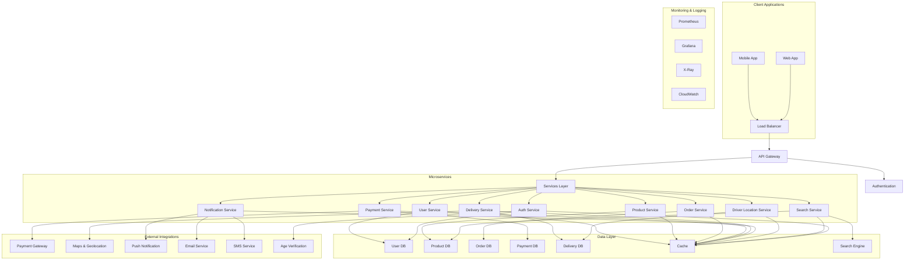
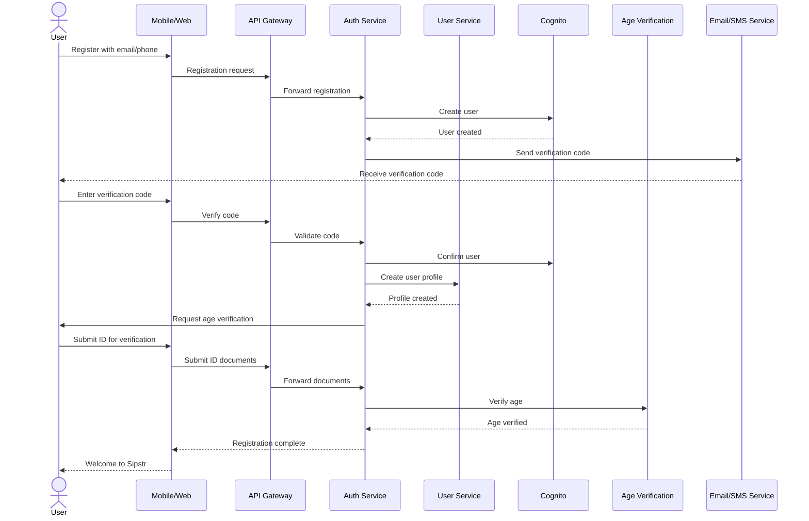
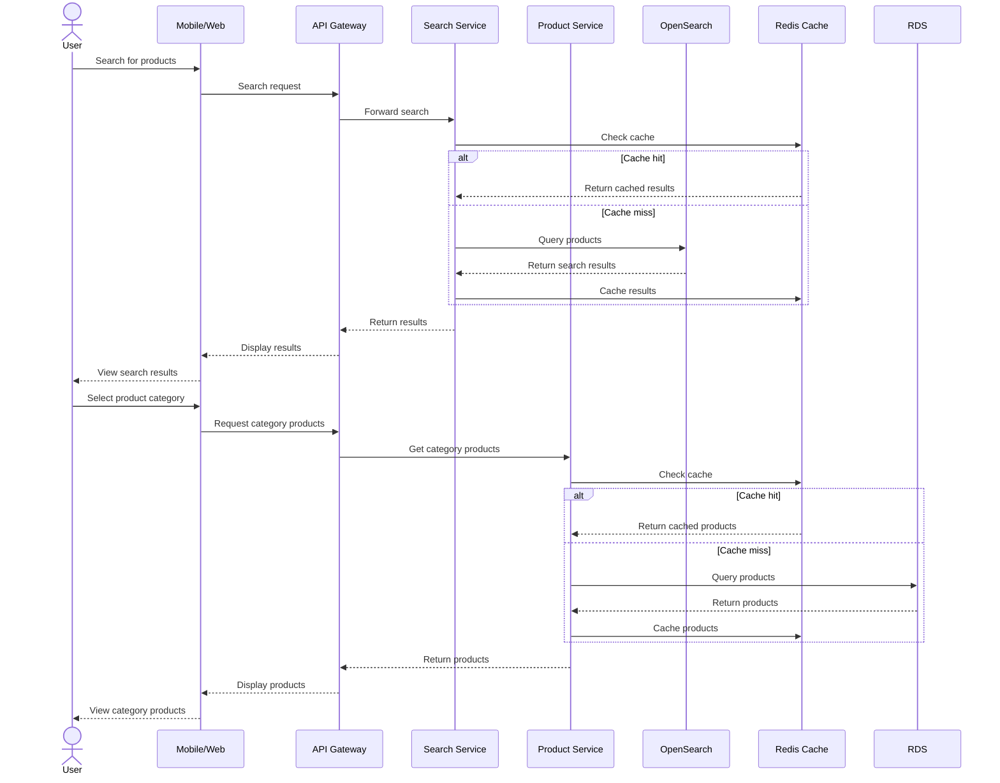
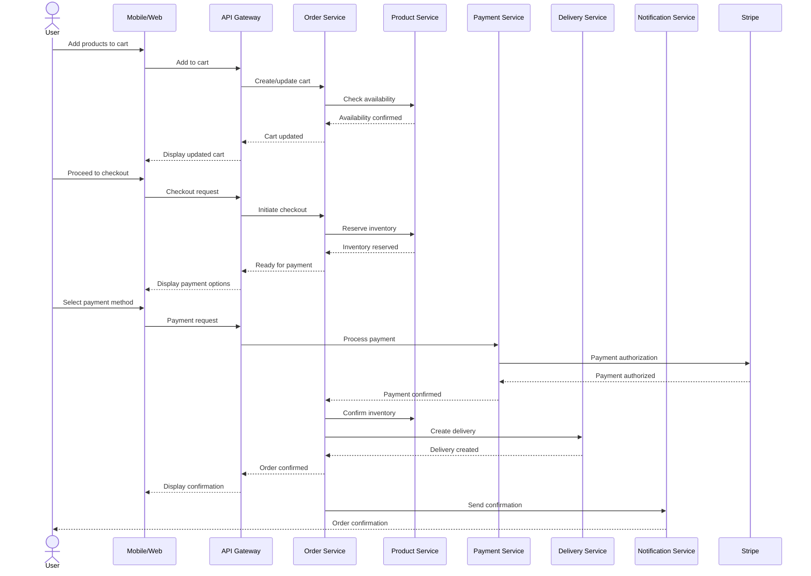
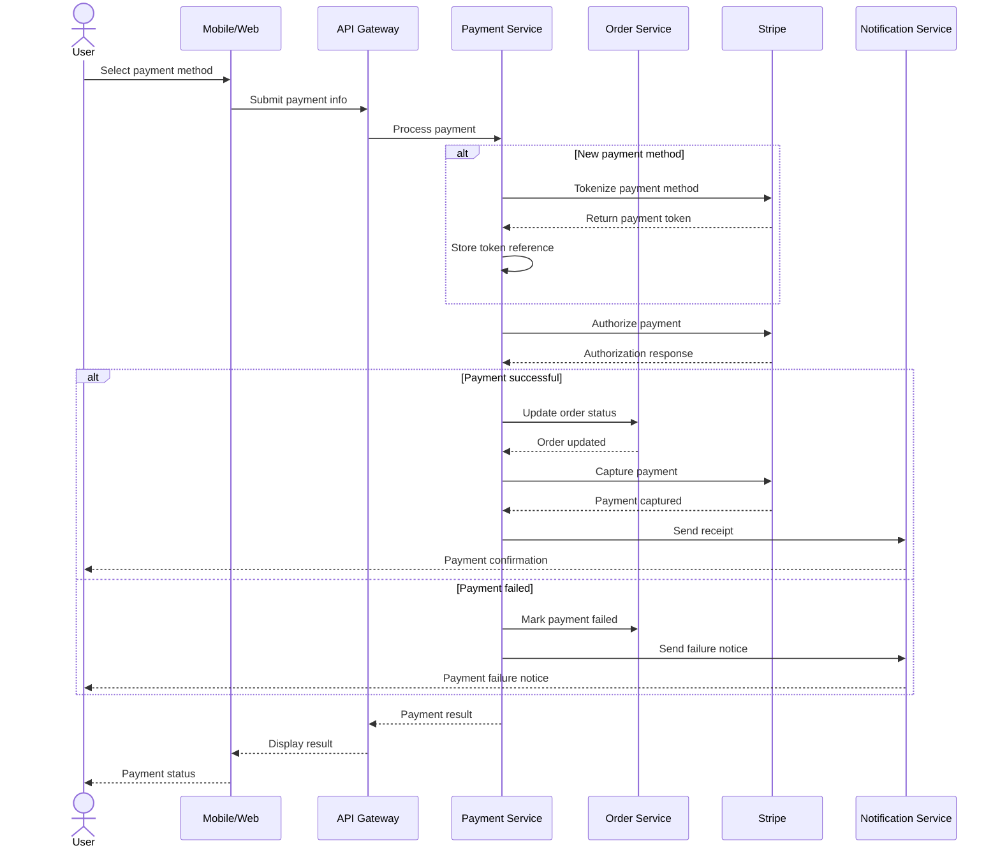
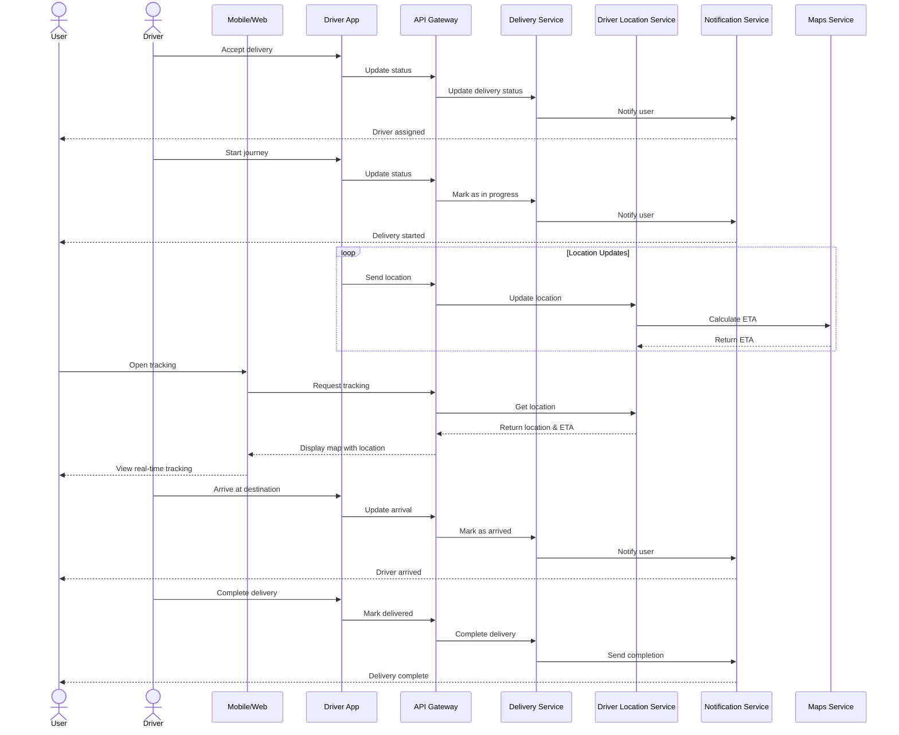
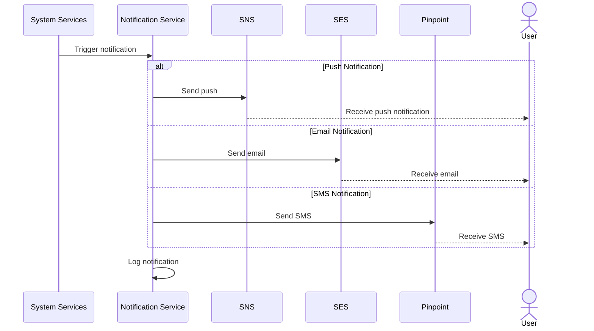

# Sipstr: Alcohol Instant Delivery Application
## System Design Document

### Table of Contents
1. [Introduction](#introduction)
2. [System Overview](#system-overview)
3. [Architecture](#architecture)
   - [High-Level Architecture](#high-level-architecture)
   - [AWS Infrastructure](#aws-infrastructure)
4. [Data Model](#data-model)
   - [Entity Relationship Diagram](#entity-relationship-diagram)
   - [Key Entities Description](#key-entities-description)
5. [Application Layers](#application-layers)
   - [Client Layer](#client-layer)
   - [API Gateway Layer](#api-gateway-layer)
   - [Microservices Architecture](#microservices-architecture)
   - [Database Layer](#database-layer)
   - [External Services](#external-services)
   - [Security Layer](#security-layer)
   - [DevOps Infrastructure](#devops-infrastructure)
   - [Monitoring & Logging](#monitoring--logging)
6. [Key Workflows](#key-workflows)
   - [User Registration and Authentication](#user-registration-and-authentication)
   - [Product Search and Browsing](#product-search-and-browsing)
   - [Order Placement](#order-placement)
   - [Payment Processing](#payment-processing)
   - [Delivery Tracking](#delivery-tracking)
   - [Notification System](#notification-system)
7. [Non-Functional Requirements](#non-functional-requirements)
   - [Performance](#performance)
   - [Scalability](#scalability)
   - [Security](#security)
   - [Availability](#availability)
   - [Compliance](#compliance)
8. [Development Guidelines](#development-guidelines)
9. [Appendix](#appendix)

---

## Introduction

Sipstr is an alcohol instant delivery platform designed to provide users with a convenient way to order alcoholic beverages for quick delivery through mobile and web applications. This document provides a comprehensive system design to guide the development of the Sipstr application from the ground up.

### Purpose
This document aims to:
- Provide a clear understanding of the system architecture and components
- Define the data model and relationships
- Outline key workflows and business processes
- Specify technology stack and infrastructure requirements
- Establish development guidelines and best practices

### Target Audience
- Project Stakeholders
- Development Team
- Quality Assurance Team
- DevOps and Infrastructure Engineers
- Product Managers

### Scope
The Sipstr platform includes:
- Mobile applications (iOS and Android)
- Web application
- Backend services
- Administrative dashboard
- Vendor management system
- Driver application
- Payment integration
- Delivery tracking
- Age verification system

---

## System Overview

Sipstr is built on a modern microservices architecture deployed on AWS cloud infrastructure. The system encompasses multiple client applications, a robust backend, and integrations with external services to provide a seamless alcohol delivery experience.

### Key Features
- User registration with age verification
- Browsing and searching alcohol products
- Real-time inventory management
- Secure payment processing
- Order tracking
- Driver assignment and route optimization
- Notifications and updates
- Reviews and ratings
- Loyalty program

### Compliance Requirements
- Age verification for alcohol purchase (21+ in the US)
- Alcohol delivery regulations compliance
- Payment Card Industry Data Security Standard (PCI DSS)
- General Data Protection Regulation (GDPR)/CCPA where applicable
- Local liquor licensing laws

---

## Architecture

### High-Level Architecture

The Sipstr application follows a microservices architecture pattern with clear separation of concerns and loosely coupled services. This architecture enables independent scaling, deployment, and maintenance of individual components.

#### Architecture Diagram

### AWS Infrastructure

Based on the deployment diagram provided, Sipstr utilizes a comprehensive AWS cloud infrastructure:

#### Network & Content Delivery
- **AWS Route 53**: DNS management
- **AWS CloudFront**: CDN for static content delivery

#### Storage
- **Amazon S3**: Static assets storage (images, static files)
- **AWS EFS**: Shared storage for application data

#### Compute & Containers
- **ECS with Fargate**: Container orchestration for microservices
- **ECR**: Container registry for Docker images

#### API Management
- **AWS API Gateway**: API management, security, throttling

#### Security
- **AWS WAF**: Web Application Firewall for protecting against web attacks
- **AWS Shield**: DDoS protection
- **AWS Cognito**: User authentication and authorization
- **AWS IAM**: Identity and access management
- **AWS Secret Manager**: Secure storage of credentials and secrets

#### CI/CD Pipeline
- **AWS CodePipeline**: Continuous Integration/Delivery pipeline
- **AWS CodeBuild**: Build service for CI/CD
- **AWS CodeDeploy**: Automated deployment service

#### Database & Caching
- **AWS RDS (PostgreSQL)**: Primary relational database
- **RDS Read Replica**: For scaling read operations
- **AWS ElastiCache (Redis)**: In-memory caching
- **AWS OpenSearch**: Search functionality

#### Messaging & Stream Processing
- **AWS MSK (Kafka)**: Stream processing
- **AWS SNS**: Push notification service
- **AWS SES**: Email service

#### Monitoring & Logging
- **AWS CloudWatch**: Monitoring and alerting
- **AWS X-Ray**: Distributed tracing
- **Prometheus**: Metrics collection
- **Grafana**: Metrics visualization

#### External Services
- **Stripe**: Payment gateway integration
- **AWS Location Service/Google Maps**: Maps and geolocation services
- **Amazon Pinpoint**: SMS/OTP services

---

## Data Model

### Entity Relationship Diagram

Based on the database schema diagram provided, the Sipstr application has a comprehensive data model with the following key entities.

#### Key Entities Description

1. **User**
   - Stores user account information
   - Contains authentication details
   - Linked to user_addresses for delivery locations
   - Associated with orders

2. **Product**
   - Represents alcoholic beverages available for purchase
   - Categories include beer, wine, spirits, etc.
   - Has attributes like price, description, ABV, origin
   - Contains inventory information

3. **Category**
   - Hierarchical organization of products
   - Examples: Wine > Red Wine > Cabernet Sauvignon

4. **Order**
   - Represents a customer purchase
   - Contains order status, timestamps, total amount
   - Linked to order_items for individual products
   - Connected to user_address for delivery location
   - Linked to driver for delivery assignment

5. **Order_Item**
   - Individual items within an order
   - Quantity, price at time of purchase
   - Link to the product

6. **Payment**
   - Payment information for orders
   - Payment method, status, amount
   - Transaction references

7. **Driver**
   - Driver information including availability status
   - Current location tracking
   - Performance metrics

8. **User_Address**
   - Delivery addresses for users
   - Geolocation coordinates for mapping
   - Address verification status

9. **Review**
   - Product and order reviews
   - Ratings and comments
   - Verification of purchase

10. **Inventory**
    - Current stock levels
    - Store/vendor information
    - Pricing information

11. **Store**
    - Partner stores/vendors selling products
    - Operating hours, location
    - Inventory association

### Extended Entity Relationships

In addition to the core entities identified in your database diagram, we recommend the following entities to complete the system:

12. **Promotion**
    - Discount codes and special offers
    - Validity periods
    - Applicable products and categories

13. **Loyalty_Program**
    - Points system
    - Redemption rules
    - User point balances

14. **Age_Verification**
    - Verification records
    - ID document references
    - Verification status and method

15. **Notification**
    - Message templates
    - Delivery status
    - User preferences

---

## Application Layers

### Client Layer

#### Mobile Application (React Native)
- Cross-platform mobile application for iOS and Android
- Native components for optimal performance
- Offline capabilities for order history and product browsing
- Push notification integration
- Location services for address detection and delivery tracking

#### Web Application (React)
- Responsive web application
- Progressive Web App (PWA) capabilities
- Shared components with mobile app where possible

#### Common Features
- User authentication
- Product browsing and search
- Cart management
- Checkout process
- Order tracking
- Account management
- Saved addresses and payment methods
- Order history

### API Gateway Layer

The API Gateway serves as the entry point for all client requests, providing:

- Request routing to appropriate microservices
- Authentication and authorization
- Request validation
- Rate limiting and throttling
- API versioning
- Request/response transformation
- Caching
- Analytics and monitoring

### Microservices Architecture

Based on your deployment diagram, Sipstr implements the following microservices:

1. **User Service**
   - User account management
   - Profile information
   - Preferences
   - Address management
   - Age verification status

2. **Product Service**
   - Product catalog management
   - Categories and tags
   - Pricing information
   - Product availability
   - Product recommendations

3. **Order Service**
   - Order creation and management
   - Order status updates
   - Order history
   - Cart management

4. **Payment Service**
   - Payment processing
   - Transaction management
   - Refund handling
   - Payment method management

5. **Delivery Service**
   - Delivery logistics
   - Delivery time estimation
   - Delivery zone management
   - Store/vendor selection

6. **Driver Location Service**
   - Real-time driver tracking
   - Route optimization
   - ETA calculations
   - Driver availability management

7. **Notification Service**
   - Push notifications
   - Email notifications
   - SMS notifications
   - In-app notifications
   - Event-driven notification triggers

8. **Search Service**
   - Product search with filtering
   - Search suggestions
   - Relevance ranking
   - Category-based search

9. **Auth Service**
   - Authentication and authorization
   - Token management
   - Session handling
   - Role-based access control
   - Age verification integration

### Database Layer

The database layer consists of:

1. **Main Database (AWS RDS PostgreSQL)**
   - Primary relational database for transactional data
   - Normalized schema for data integrity
   - Read replicas for scaling read operations

2. **Search Engine (AWS OpenSearch)**
   - Product search indexing
   - Full-text search capabilities
   - Faceted search for filtering

3. **Cache Layer (AWS ElastiCache Redis)**
   - Session storage
   - Frequently accessed data caching
   - Rate limiting implementation
   - Temporary data storage

### External Services

1. **Payment Gateway (Stripe)**
   - Credit/debit card processing
   - Alternative payment methods
   - Subscription management for premium features
   - PCI compliance handling

2. **Geolocation Services (AWS Location Service/Google Maps)**
   - Address validation
   - Geocoding and reverse geocoding
   - Distance calculation
   - Route optimization
   - ETA calculation

3. **Notification Services**
   - **AWS SNS**: Push notifications
   - **AWS SES**: Email notifications
   - **Amazon Pinpoint**: SMS/OTP for verification

### Security Layer

1. **Perimeter Security**
   - AWS WAF for web application firewall
   - AWS Shield for DDoS protection
   - HTTPS/TLS for all communications

2. **Authentication & Authorization**
   - AWS Cognito for user authentication
   - JWT token-based authentication
   - Role-based access control
   - OAuth 2.0 integration for social logins

3. **Data Security**
   - Encryption at rest for sensitive data
   - Encryption in transit (TLS/SSL)
   - Secure key management (AWS KMS)
   - PII data handling compliance

4. **Compliance**
   - Age verification systems
   - Regulatory compliance for alcohol delivery
   - Data protection (GDPR/CCPA)

### DevOps Infrastructure

1. **CI/CD Pipeline**
   - AWS CodePipeline for continuous integration and delivery
   - AWS CodeBuild for automated builds
   - AWS CodeDeploy for deployment automation
   - Infrastructure as Code using AWS CloudFormation or Terraform

2. **Container Orchestration**
   - ECS with Fargate for serverless container management
   - ECR for Docker image repository

### Monitoring & Logging

1. **Monitoring Tools**
   - AWS CloudWatch for AWS resource monitoring
   - Prometheus for metrics collection
   - Grafana for metrics visualization
   - AWS X-Ray for distributed tracing

2. **Logging**
   - Centralized logging
   - Log analysis and alerting
   - Audit trail for compliance

3. **Alerting**
   - Real-time alerts for system issues
   - Escalation paths
   - On-call rotations

---

## Key Workflows

### User Registration and Authentication

### Product Search and Browsing

### Order Placement

### Payment Processing

### Delivery Tracking

### Notification System

---

## Non-Functional Requirements

### Performance

1. **Response Time**
   - API response time < 200ms for 95% of requests
   - Search results returned in < 500ms
   - Page load time < 2 seconds

2. **Throughput**
   - Support 1000+ concurrent users
   - Handle 100+ orders per minute during peak times

3. **Resource Utilization**
   - CPU utilization < 70% under normal load
   - Memory utilization < 80% under normal load

### Scalability

1. **Horizontal Scaling**
   - Auto-scaling for API services based on CPU/memory utilization
   - Database read replicas for scaling read operations
   - Caching layer to reduce database load

2. **Capacity Planning**
   - Design for 10x growth in user base
   - Support for seasonal peaks (holidays, weekends)

### Security

1. **Data Protection**
   - Encryption of PII data at rest and in transit
   - Secure storage of payment information
   - Regular security audits and penetration testing

2. **Authentication & Authorization**
   - Multi-factor authentication option
   - Role-based access control
   - JWT token-based authentication with short expiry

3. **API Security**
   - Rate limiting to prevent abuse
   - Input validation for all endpoints
   - Protection against common attacks (OWASP Top 10)

### Availability

1. **Uptime**
   - 99.9% uptime for core services
   - Fault tolerance through redundancy

2. **Disaster Recovery**
   - Regular database backups
   - Cross-region replication for critical data
   - Recovery time objective (RTO) < 1 hour
   - Recovery point objective (RPO) < 15 minutes

### Compliance

1. **Regulatory Compliance**
   - Age verification for alcohol purchases
   - Local liquor license requirements
   - GDPR/CCPA compliance for data protection

2. **Industry Standards**
   - PCI DSS compliance for payment processing
   - OWASP security standards
   - Accessibility standards (WCAG 2.1)

---

## Development Guidelines

1. **Code Style & Standards**
   - Consistent coding style across services
   - Code documentation requirements
   - Unit test coverage requirements (minimum 80%)

2. **API Design**
   - RESTful API design principles
   - API versioning strategy
   - Consistent error handling and status codes

3. **Microservice Development**
   - Service boundaries and responsibilities
   - Inter-service communication patterns
   - Data consistency strategies

4. **Testing Strategy**
   - Unit testing requirements
   - Integration testing approach
   - Performance testing methodology
   - Security testing procedures

5. **Deployment Process**
   - CI/CD pipeline usage
   - Deployment environments (Dev, QA, Staging, Production)
   - Blue/green deployment strategy
   - Rollback procedures

---

## Appendix

### Technology Stack

1. **Frontend**
   - Mobile: React Native
   - Web: React.js, Redux, Tailwind CSS
   - Driver App: React Native

2. **Backend**
   - Language: Java/Spring Boot
   - API Gateway: AWS API Gateway
   - Container Orchestration: AWS ECS with Fargate

3. **Database & Storage**
   - Primary Database: AWS RDS (PostgreSQL)
   - Cache: AWS ElastiCache (Redis)
   - Search: AWS OpenSearch
   - Object Storage: AWS S3

4. **DevOps**
   - CI/CD: AWS CodePipeline, CodeBuild, CodeDeploy
   - Monitoring: Prometheus, Grafana, AWS CloudWatch, AWS X-Ray
   - Infrastructure as Code: Terraform or AWS CloudFormation

5. **External Services**
   - Payment Processing: Stripe
   - Maps & Geolocation: AWS Location Service or Google Maps
   - SMS/OTP: Amazon Pinpoint
   - Email: AWS SES
   - Push Notifications: AWS SNS
